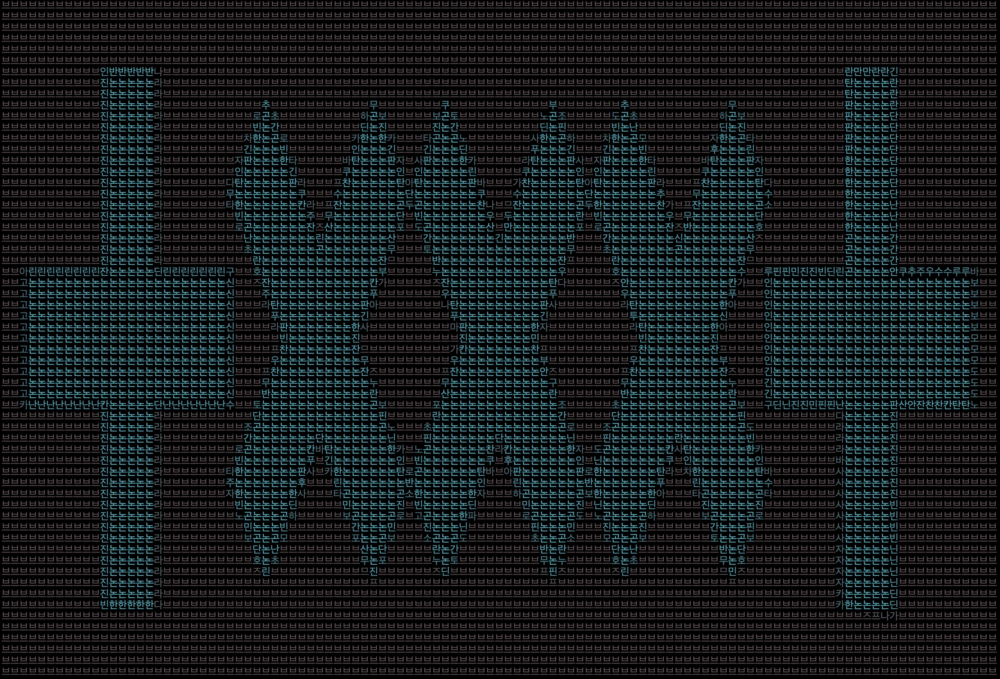
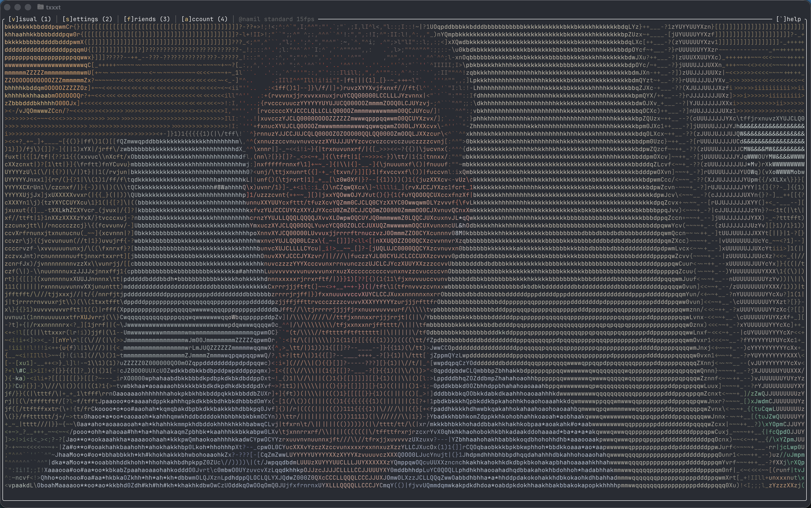
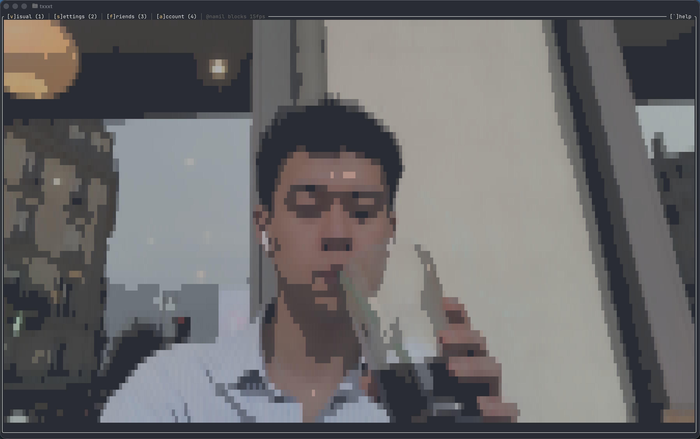
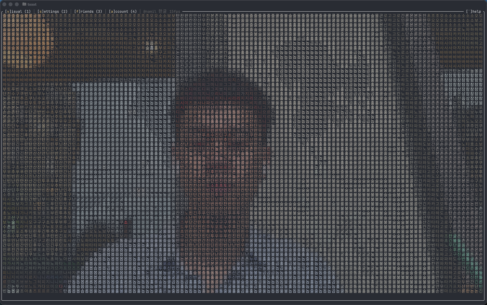
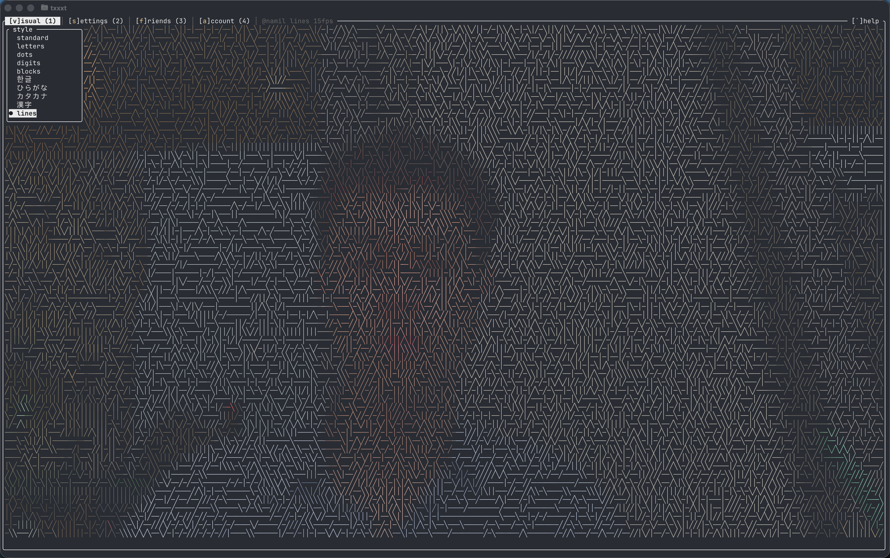
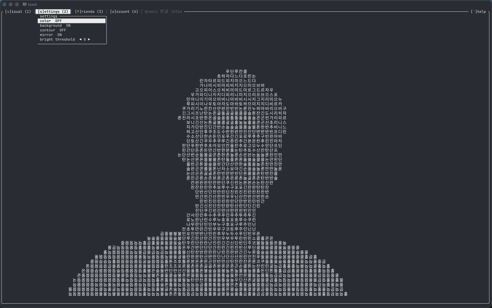
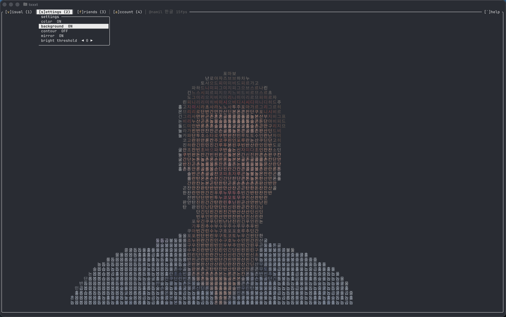

<p align="center">
  
</p>
<p align="center">
  Terminal-based video chat with ASCII art
  <br />
  <a href="https://txxxt.me">txxxt.me</a> · <a href="https://github.com/namil-k/txxxt/releases">Releases</a>
</p>

<p align="center">
  <a href="https://github.com/namil-k/txxxt/releases/latest"></a>
  <a href="https://github.com/namil-k/txxxt/blob/main/LICENSE"></a>
  <a href="https://github.com/namil-k/txxxt/stargazers"></a>
</p>

---

Turn your webcam into real-time ASCII art. Call your friends — right from your terminal.

<p align="center">
  
</p>

## Visual Styles

<table>
  <tr>
    <td align="center"><br /><b>blocks</b></td>
    <td align="center"><br /><b>한글</b></td>
  </tr>
  <tr>
    <td align="center"><br /><b>lines</b></td>
    <td align="center"><br /><b>한글 + no color</b></td>
  </tr>
</table>

## Background Removal

<p align="center">
  
</p>

AI-powered body segmentation removes the background in real time. Works with any visual style.

## Install

```bash
# Cargo (Rust)
cargo install txxxt

# or install script (macOS ARM64, Linux x86_64)
curl -fsSL https://raw.githubusercontent.com/namil-k/txxxt/main/install.sh | bash
```

Then run: `txxxt`

## Features

- **ASCII webcam viewer** — 10 visual styles (standard, letters, dots, digits, blocks, 한글, ひらがな, カタカナ, 漢字, lines)
- **Video call** — relay-based, works across any network
- **Audio** — mic + speaker with echo cancellation
- **Friends & direct call** — register a username, add friends, call @username
- **Room codes** — press `r`, share a 6-char code, done
- **Contour overlay** — silhouette outline drawn on top of any visual style
- **Background removal** — body or face-only segmentation (ONNX)
- **PIP layout** — FaceTime-style with movable, resizable picture-in-picture
- **Menu bar** — macOS-style top menu with keyboard shortcuts
- **Auto-update** — `txxxt update`
- **Cross-platform** — macOS (ARM64), Linux (x86_64)

## Video Call

**Create a room:**

Press `r` in the app. An invite message is copied to your clipboard:

```
txxxt me ↓
code: ABCDEF
txxxt.me/ABCDEF
```

**Join a room:**

```bash
txxxt ABCDEF
```

Or press `c` in the app and type the code.

**Direct call:**

```bash
txxxt @username
```

Or press `f` (friends) in the app and select a friend to call.

## Account & Friends

Register a username to use friends and direct calling:

```bash
txxxt activate <LICENSE_KEY>
txxxt register <USERNAME>
```

Or do everything inside the TUI — press `a` (account) to register/login, then `f` (friends) to manage your friend list.

## Keybindings

### Menu Bar

| Key | Action |
|-----|--------|
| `v` / `1` | Visual style picker |
| `s` / `2` | Settings (color, background, contour, mirror, brightness) |
| `f` / `3` | Friends (add, remove, call) |
| `a` / `4` | Account (register, login, logout) |
| `` ` `` | Help overlay |

### General

| Key | Action |
|-----|--------|
| `r` | Create relay room |
| `c` | Connect (room code) |
| `y` | Copy snapshot to clipboard |
| `q` | Quit |

### In Call

| Key | Action |
|-----|--------|
| `m` | Mute / unmute mic |
| `h` | Hide / show camera |
| `p` | Move PIP (cycles corners) |
| `+` / `-` | Resize PIP |

## CLI

```bash
txxxt                  # open webcam viewer
txxxt ABCDEF           # join room directly
txxxt @username        # direct call
txxxt update           # update to latest version
txxxt activate <KEY>   # activate txxxt+ license
txxxt register <NAME>  # register username
txxxt login            # login with saved key
txxxt friends list     # list friends
txxxt friends add <U>  # add friend
```

## Build from Source

```bash
git clone https://github.com/namil-k/txxxt.git
cd txxxt
cargo build --release
```

## Requirements

- A terminal with Unicode support
- A webcam
- macOS (ARM64) or Linux (x86_64)

## License

MIT
